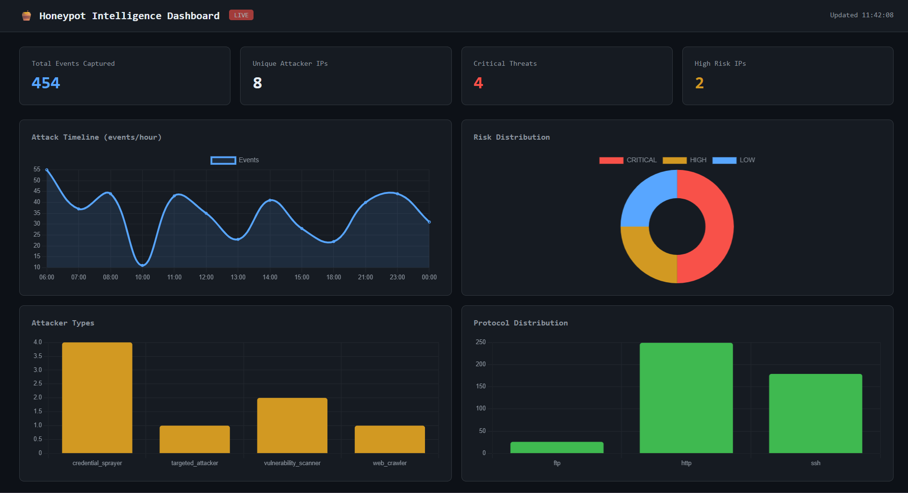
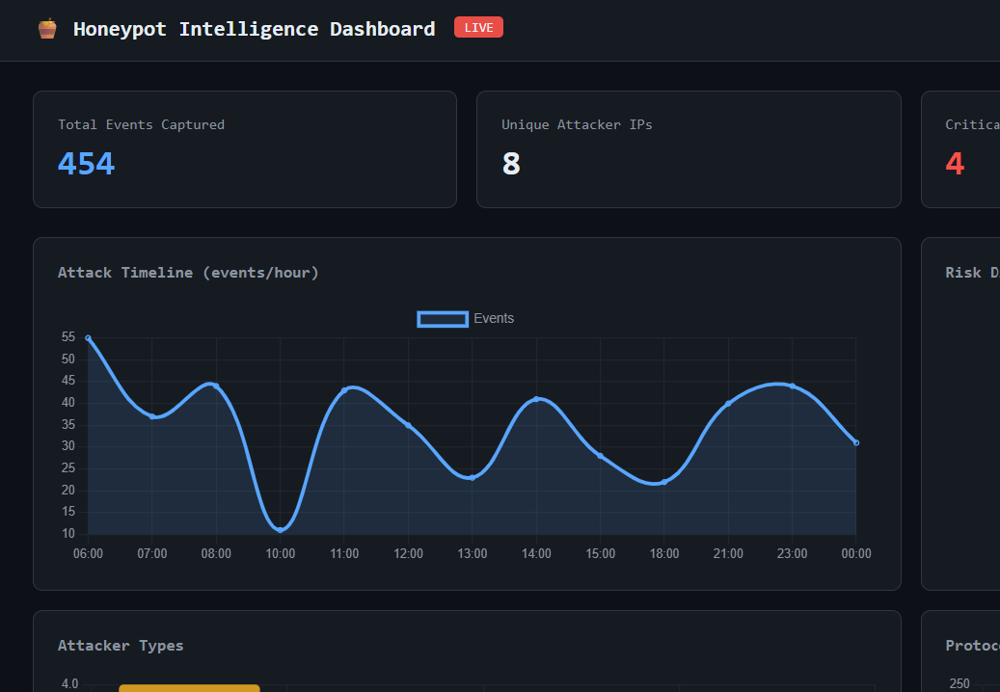
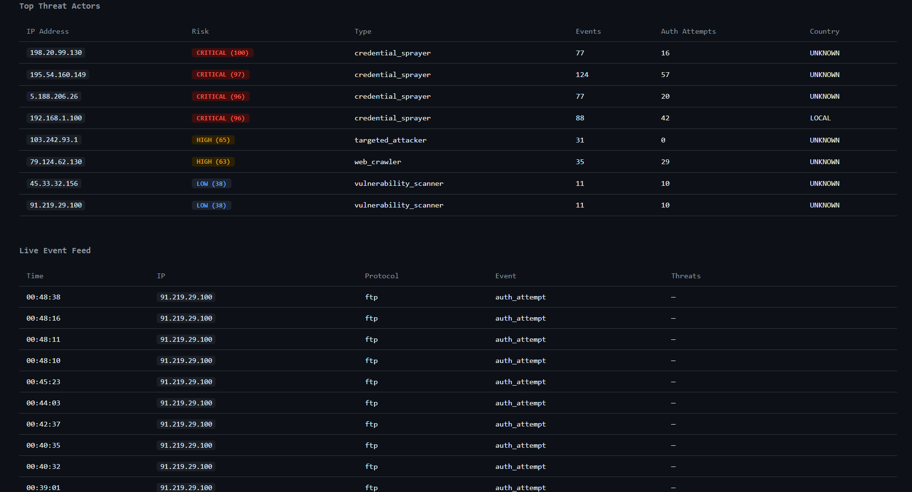
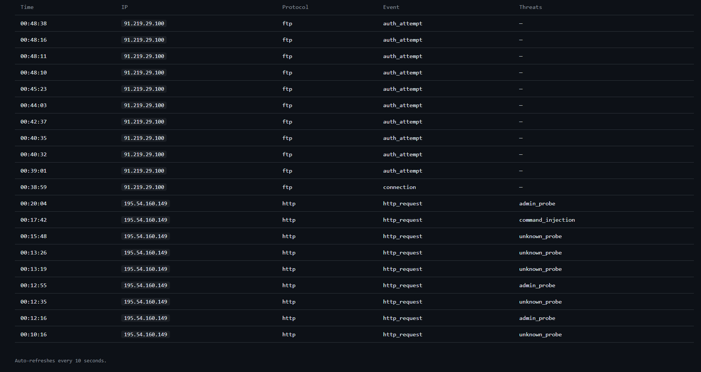

# 🍯 Intelligent Honeypot Analytics & Threat Detection System


A production-grade cybersecurity project that deploys fake SSH, HTTP, and FTP servers to lure attackers, captures their behavior, and applies machine learning to classify threats and auto-block malicious IPs in real time.

---

## 📸 Screenshots

### 🖥️ Dashboard Overview


### 📊 Full Dashboard with All Charts
> Attack Timeline · Risk Distribution · Attacker Types · Protocol Distribution



### 🎯 Top Threat Actors Table
> ML-classified attacker IPs ranked by risk score (0–100) with behavior type, event count, and country



### 📡 Live Event Feed
> Real-time stream of every attack — protocol, event type, and threat category detected



---

## 🧠 How It Works

```
Attacker (Internet)
       │
       ▼
┌─────────────────────────────┐
│     Honeypot Layer          │
│  SSH (2222) · HTTP (8080)   │
│  FTP (2121)                 │
└────────────┬────────────────┘
             │  JSON logs
             ▼
┌─────────────────────────────┐
│     AI Analytics Engine     │
│  Isolation Forest · KMeans  │
│  IP Reputation · Risk Score │
└──────┬──────────────┬───────┘
       │              │
       ▼              ▼
┌───────────┐  ┌─────────────┐
│   Alerts  │  │ Auto-Block  │
│Slack+Email│  │  iptables   │
└───────────┘  └─────────────┘
       │
       ▼
┌─────────────────────────────┐
│   Flask Web Dashboard       │
│   http://localhost:5000     │
└─────────────────────────────┘
```

---

## ✨ Features

- **Multi-Protocol Honeypots** — Fake SSH, HTTP, and FTP servers that look real to attackers
- **7 Threat Signature Categories** — SQL injection, command injection, path traversal, XSS, file inclusion, admin probing, scanner detection
- **ML-Based Classification** — Isolation Forest for anomaly detection + KMeans clustering to profile attacker behavior types
- **Risk Scoring** — Every attacker IP gets a 0–100 risk score with labels: CRITICAL / HIGH / MEDIUM / LOW
- **Auto IP Blocking** — iptables automatically drops packets from CRITICAL-rated IPs
- **Real-Time Alerting** — Slack webhook + SMTP email alerts with severity-based routing
- **Live Web Dashboard** — Flask + Chart.js dashboard with attack timelines, risk charts, and live event feed

---

## 📊 Live Results

From an actual run of this project:

| Metric | Value |
|---|---|
| Total Events Captured | 454 |
| Unique Attacker IPs | 8 |
| Critical Threats Detected | 4 |
| High Risk IPs | 2 |
| Top Attacker Risk Score | 100 / 100 |
| Protocols Monitored | SSH · HTTP · FTP |

**Attacker types detected by ML:**

| IP | Risk Score | ML Classification |
|---|---|---|
| 198.20.99.130 | CRITICAL (100) | credential_sprayer |
| 195.54.160.149 | CRITICAL (97) | credential_sprayer |
| 5.188.206.26 | CRITICAL (96) | credential_sprayer |
| 192.168.1.100 | CRITICAL (96) | credential_sprayer |
| 103.242.93.1 | HIGH (65) | targeted_attacker |
| 79.124.62.130 | HIGH (63) | web_crawler |
| 45.33.32.156 | LOW (38) | vulnerability_scanner |
| 91.219.29.100 | LOW (38) | vulnerability_scanner |

---

## 🗂️ Project Structure

```
honeypot-project/
├── honeypots/
│   ├── ssh_honeypot.py        # Paramiko SSH server — logs credentials & commands
│   ├── http_honeypot.py       # HTTP server with 7-category signature detection
│   └── ftp_honeypot.py        # FTP server — captures credential spray attacks
├── analytics/
│   └── analytics_engine.py    # ML pipeline: IsolationForest + KMeans + risk scoring
├── alerts/
│   └── alert_engine.py        # Slack + email alerting with deduplication
├── dashboard/
│   └── dashboard.py           # Flask web dashboard with Chart.js visualizations
├── scripts/
│   ├── auto_block.py          # iptables-based automatic IP blocking
│   └── generate_test_logs.py  # Realistic fake attack log generator for testing
├── screenshots/               # Dashboard screenshots
├── logs/                      # Auto-created — all honeypot JSON logs (gitignored)
├── models/                    # Saved ML models via joblib (gitignored)
├── config/
│   └── ip_blacklist.txt       # Persistent blocked IP list
├── requirements.txt
├── run_all.py                 # One-command launcher for all services
└── README.md
```

---

## 🚀 Quick Start

### 1. Clone the Repository
```bash
git clone https://github.com/YOUR_USERNAME/honeypot-threat-detection.git
cd honeypot-threat-detection
```

### 2. Install Dependencies
```bash
pip install -r requirements.txt
```

### 3. Generate Test Data
```bash
python scripts/generate_test_logs.py
```

### 4. Run ML Analytics
```bash
python analytics/analytics_engine.py
```

### 5. Start the Dashboard
```bash
python dashboard/dashboard.py
# Open http://localhost:5000
```

### 6. Start All Honeypots
```bash
python run_all.py
```

---

## 🧪 Testing the Honeypots

```bash
# Test SSH honeypot
ssh -p 2222 root@localhost

# Test HTTP honeypot — SQL injection
curl "http://localhost:8080/?id=1 OR 1=1--"

# Test HTTP honeypot — admin probe
curl http://localhost:8080/admin

# Test FTP honeypot
ftp localhost 2121
```

After testing, re-run analytics and refresh the dashboard — your own IP will appear in the threat table.

---

## 📊 ML Models Used

| Model | Purpose |
|---|---|
| Isolation Forest | Anomaly detection — finds unusual attacker behavior |
| KMeans Clustering | Classifies attackers into behavior types |
| Regex Signatures | Real-time pattern matching for 7 threat categories |

**Attacker types classified:**
- `credential_sprayer` — tries thousands of username/password combos
- `targeted_attacker` — focused, persistent, runs commands after login
- `vulnerability_scanner` — probes paths, ports, known CVEs
- `web_crawler` — automated scanning of HTTP endpoints

---

## ⚙️ Configuration

### Slack Alerts
```bash
export SLACK_WEBHOOK_URL="https://hooks.slack.com/services/YOUR/WEBHOOK/URL"
python alerts/alert_engine.py --watch
```

### Email Alerts
```bash
export SMTP_USER="your@gmail.com"
export SMTP_PASS="your_app_password"
export ALERT_EMAIL="security@yourdomain.com"
python alerts/alert_engine.py
```

### Auto IP Blocking (Linux only — requires root)
```bash
sudo python scripts/auto_block.py --dry-run    # Preview first
sudo python scripts/auto_block.py              # Apply blocks
sudo python scripts/auto_block.py --unblock-all # Remove all blocks
```

---

## 🛠️ Tech Stack

| Category | Tools |
|---|---|
| Language | Python 3.10+ |
| Honeypots | Paramiko, Python socket, http.server |
| Machine Learning | scikit-learn, NumPy, joblib |
| Web Dashboard | Flask, Chart.js |
| Alerting | Slack Webhooks, SMTP |
| Firewall | iptables |
| OS | Windows / Kali Linux |
| Log Format | JSON / JSONL |

---

## ⚠️ Security Warning

- Run honeypots **only in a VM or isolated lab network** — never on a machine with sensitive data
- Do **not** expose port 5000 (dashboard) to the internet
- Always run `auto_block.py --dry-run` before applying iptables rules
- This project is for **educational and research purposes only**

---

## 📄 License

MIT License — free to use, modify, and distribute.

---

## 👤 Author

**Your Name**
- GitHub: [@YOUR_USERNAME](https://github.com/YOUR_USERNAME)
- LinkedIn: [your-linkedin](https://linkedin.com/in/your-linkedin)

---

⭐ If this project helped you, please give it a star on GitHub!
